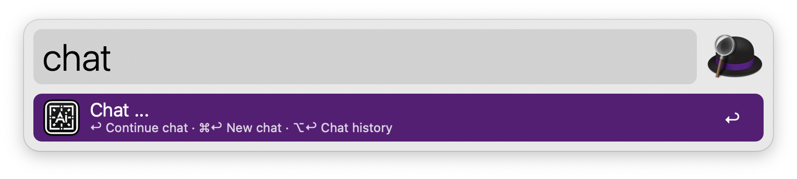
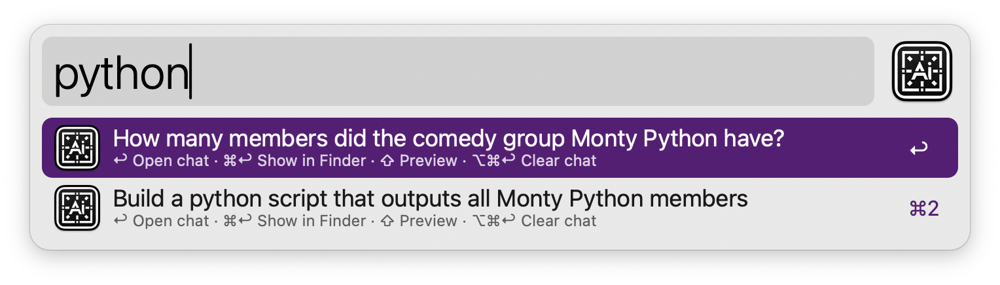
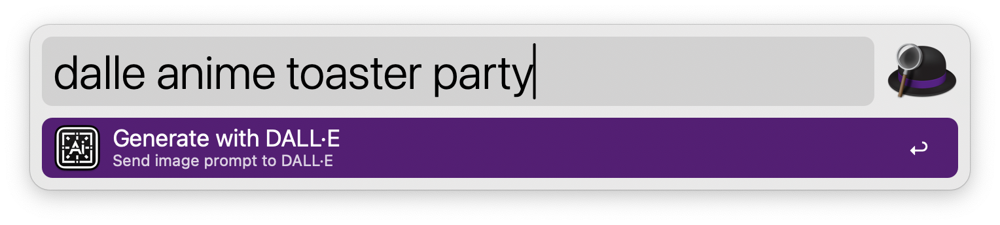

#  IA Chat Alfred Workflow

AI Chat integration

## Prerequisites

You need to have at least one account for OpenAI, Gemini, OpenRouter or Deepseek:

1. Create an api platform account.
2. On the API keys page create new secret key.
3. Name your new secret key.

Platforms

* https://platform.openai.com
* https://aistudio.google.com
* https://openrouter.ai
* https://platform.deepseek.com

## Build

Build the workflow package inside the cloned repository.

`ditto -ck Workflow openai.alfredworkflow`

## Install

Build the workflow package inside the cloned repository.

`open openai.alfredworkflow`

## Configure

Copy your secret key(s) and add it to the [Workflow’s Configuration](https://www.alfredapp.com/help/workflows/user-configuration/).

## Usage

### IA Chat

Query ChatGPT via the `chat` keyword, the [Universal Action](https://www.alfredapp.com/help/features/universal-actions/), or the [Fallback Search](https://www.alfredapp.com/help/features/default-results/fallback-searches/).

* <kbd>↩&#xFE0E;</kbd> Ask a new question.
* <kbd>⌘</kbd><kbd>↩&#xFE0E;</kbd> Clear and start new chat.
* <kbd>⌥</kbd><kbd>↩&#xFE0E;</kbd> Copy last answer.
* <kbd>⌃</kbd><kbd>↩&#xFE0E;</kbd> Copy full chat.
* <kbd>⇧</kbd><kbd>↩&#xFE0E;</kbd> Stop generating answer.

#### Chat History

View Chat History with ⌥↩&#xFE0E; in the `chat` keyword. Each result shows the first question as the title and the last as the subtitle.

<kbd>↩&#xFE0E;</kbd> to archive the current chat and load the selected one. Older chats can be trashed with the `Delete` [Universal Action](https://www.alfredapp.com/help/features/universal-actions/). Select multiple chats with the [File Buffer](https://www.alfredapp.com/help/features/file-search/#file-buffer).

### DALL·E

Query DALL·E via the `dalle` keyword.

* <kbd>↩&#xFE0E;</kbd> Send a new prompt.
* <kbd>⌘</kbd><kbd>↩&#xFE0E;</kbd> Archive images.
* <kbd>⌥</kbd><kbd>↩&#xFE0E;</kbd> Reveal last image in the Finder.
